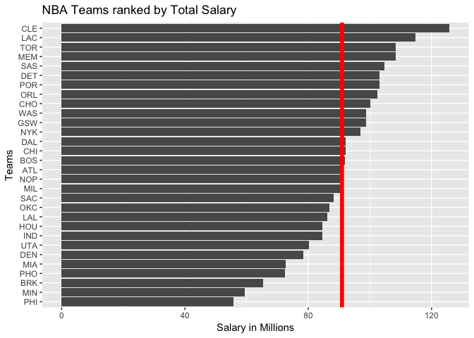
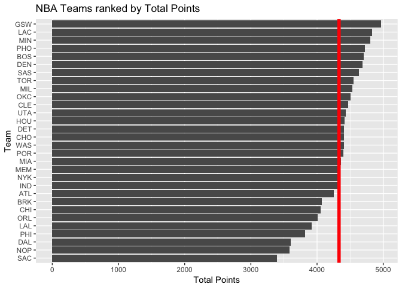
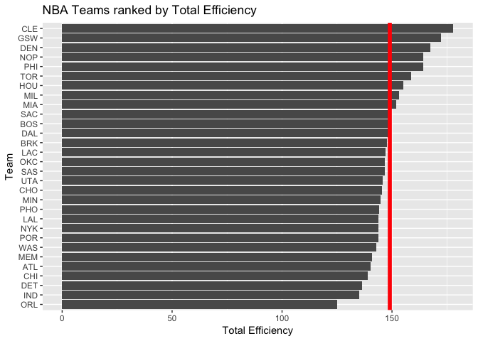
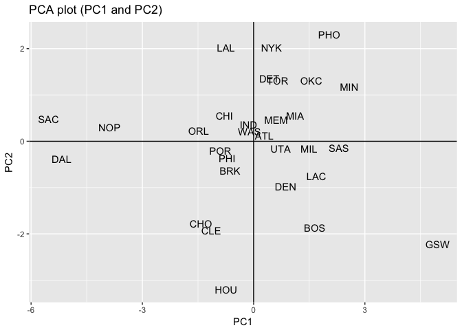
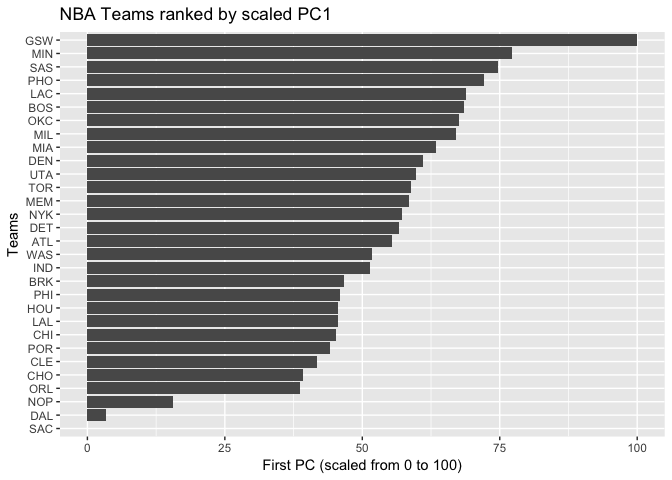

hw03-Cecilia-Li
================
Cecilia Li
10/15/2017

Loading Datas
=============

``` r
library(readr)
library(dplyr)
```

    ## 
    ## Attaching package: 'dplyr'

    ## The following objects are masked from 'package:stats':
    ## 
    ##     filter, lag

    ## The following objects are masked from 'package:base':
    ## 
    ##     intersect, setdiff, setequal, union

``` r
library(ggplot2)
```

``` r
roster <- "https://raw.githubusercontent.com/ucb-stat133/stat133-fall-2017/master/data/nba2017-roster.csv"
destination <- "nba2017-roster.csv"
download.file(url=roster,destfile = destination)
roster <- read.csv("nba2017-roster.csv",stringsAsFactors=FALSE)

stats <- "https://raw.githubusercontent.com/ucb-stat133/stat133-fall-2017/master/data/nba2017-stats.csv"
download.file(url=stats,destfile = "nba2017-stats.csv")
stats <- read.csv("nba2017-stats.csv",stringsAsFactors = FALSE)


# Adding new variables
stat1 <-
  mutate(
    stats,
    missed_fg = stats$field_goals_atts - stats$field_goals_made,
    missed_ft = stats$points1_atts - stats$points1_made,
    points = stats$points1_made + 2 * stats$points2_made + 3 * stats$points3_made,
    rebounds = stats$off_rebounds + stats$def_rebounds
  )


stat2 <-
  mutate(
    stat1,
    efficiency = (
      stat1$points + stat1$rebounds + stat1$assists +
        stat1$steals + stat1$blocks - stat1$missed_fg -
        stat1$missed_ft - stat1$turnovers
    ) / stat1$games_played
  )


# Merging tables
data <- merge(stat2, roster)


# Creating nba2017-teams.csv
teams <-
  data %>% group_by(team) %>% summarise(
    experience = round(sum(experience), 2),
    salary = sum(round(salary /
                         1000000, 2)),
    points3 = sum(points3_made),
    points2 = sum(points2_made),
    free_throws = sum(points1_made),
    points = sum(points3 + points2 + free_throws),
    off_rebounds = sum(off_rebounds),
    def_rebounds = sum(def_rebounds),
    assists = sum(assists),
    steals = sum(steals),
    blocks = sum(blocks),
    turnovers = sum(turnovers),
    fouls = sum(fouls),
    efficiency = sum(efficiency)
  )
```

``` r
# NBA Teams ranked by Total Salary
ggplot(teams, aes(x=reorder(team, salary), y=salary)) +
  geom_bar(stat='identity') +
  geom_hline(yintercept = mean(teams$salary), color="red", size = 2) +
  ggtitle("NBA Teams ranked by Total Salary") +
  labs (y = "Salary in Millions", x = "Teams") +
  coord_flip()
```



``` r
# NBA Teams ranked by Total Points
ggplot(teams, aes(x = team, y = points))+
  geom_bar(stat = 'identity') + labs(y = 'Total Points') +
  labs(x = 'Team') + labs(title = 'NBA Teams ranked by Total Points') +
  coord_flip() + geom_hline(yintercept = mean(teams$points) , col = 'red', size = 2)+
      scale_x_discrete(limits = teams$team[order(teams$points)])
```



``` r
# NBA Teams ranked by Total Efficiency
ggplot(teams, aes(x = team, y = efficiency))+
  geom_bar(stat = 'identity') + labs(y = 'Total Efficiency') +
  labs(x = 'Team') + labs(title = 'NBA Teams ranked by Total Efficiency') +
  coord_flip() + geom_hline(yintercept = mean(teams$efficiency) , col = 'red', size = 2)+
      scale_x_discrete(limits = teams$team[order(teams$efficiency)])
```

 *Provide concise descriptions of the obtained rankings so far*

The general distributions of the three plots are roughly the same. However, when ranked by total salary, CLE, LAC, and TOR are the top 3 teams, with CLE exceeding a lot than any other teams. When ranked by total points, GSW, LAC, and MIN are the top 3, and their total points are roughly the same. And when ranked by total efficiency, CLE, GSW, and DEN are the top 3. Each ranking methond provides different results, so it might be a bit hard to generalize a pattern from those 3 plots. However, just by looking at the top 3 teams, GSW and CLE seem to slightly overperform than other teams.

Principal Components Analysis (PCA)
===================================

``` r
pca <- prcomp(teams[c('points3', 'points2', 'free_throws', 'off_rebounds', 'def_rebounds',
                      'assists', 'steals', 'blocks', 'turnovers', 'fouls')], scale. = TRUE)
eigs1 <- data.frame(
  eigenvalue = round(pca$sdev^2, 4),
  prop = round(pca$sdev^2 / sum(pca$sdev^2), 4),
  cumprop = cumsum(round(pca$sdev^2 / sum(pca$sdev^2), 4))
)
eigs1
```

    ##    eigenvalue   prop cumprop
    ## 1      4.6959 0.4696  0.4696
    ## 2      1.7020 0.1702  0.6398
    ## 3      0.9795 0.0980  0.7378
    ## 4      0.7717 0.0772  0.8150
    ## 5      0.5341 0.0534  0.8684
    ## 6      0.4780 0.0478  0.9162
    ## 7      0.3822 0.0382  0.9544
    ## 8      0.2603 0.0260  0.9804
    ## 9      0.1336 0.0134  0.9938
    ## 10     0.0627 0.0063  1.0001

Use the first two PCs to get a scatterplot of the teams
=======================================================

``` r
plotted <- data.frame(pca$x[ , 1:2])
ggplot(data=plotted, aes(x=PC1, y=PC2)) + 
  geom_text(aes(label=teams$team))+
  geom_hline(aes(yintercept=0))+
  geom_vline(aes(xintercept=0)) +
  ggtitle("PCA plot (PC1 and PC2)")
```

 \# Interpretation of PCs

``` r
pca
```

    ## Standard deviations:
    ##  [1] 2.1669994 1.3046111 0.9897094 0.8784756 0.7308134 0.6913872 0.6182263
    ##  [8] 0.5101592 0.3655034 0.2503921
    ## 
    ## Rotation:
    ##                    PC1         PC2         PC3          PC4         PC5
    ## points3      0.1121782 -0.65652993  0.28806873 -0.042637313  0.28657624
    ## points2      0.3601766  0.32892544 -0.06763180 -0.347710703 -0.15173866
    ## free_throws  0.3227564 -0.17651228  0.39157491  0.147596178 -0.21363792
    ## off_rebounds 0.3029366  0.35931603  0.33884845 -0.288483019 -0.16571824
    ## def_rebounds 0.3719432 -0.12808273  0.15026131 -0.492969442  0.26476256
    ## assists      0.3125312 -0.44134618 -0.26294129 -0.088066602 -0.36972525
    ## steals       0.3447256 -0.03540585 -0.48554101  0.177578661 -0.33549491
    ## blocks       0.3162237  0.06131890 -0.48869371  0.003935374  0.65459381
    ## turnovers    0.3353958 -0.02169833  0.08910421  0.532117541 -0.04471763
    ## fouls        0.3072548  0.28954426  0.26469871  0.454751471  0.26814214
    ##                       PC6         PC7         PC8         PC9         PC10
    ## points3      -0.028435666  0.38167878  0.18027569 -0.20631322  0.409762462
    ## points2      -0.088714347  0.07302430 -0.47216199 -0.35836740  0.499011524
    ## free_throws  -0.487342521 -0.62732220  0.07726675 -0.08283563 -0.006875686
    ## off_rebounds  0.283093235  0.13535335  0.64646479 -0.14735551 -0.124601143
    ## def_rebounds  0.066309015 -0.04926346 -0.23787252  0.64632050 -0.168579984
    ## assists       0.176019008  0.11785039 -0.18235775 -0.34086739 -0.547385461
    ## steals       -0.303664534  0.25883825  0.32703573  0.41596580  0.246739300
    ## blocks       -0.009954065 -0.30799231  0.23947533 -0.27071160 -0.057627209
    ## turnovers     0.675777660 -0.18850849 -0.14308362  0.13524769  0.250947823
    ## fouls        -0.298848473  0.47268121 -0.21462859 -0.04367200 -0.335087245

Index based on PC1
==================

``` r
z1 = pca$x[ ,1]
s1 = 100 * ((z1 - min(z1))/(max(z1)-min(z1)))
new_team <- mutate(teams, s1)
```

``` r
ggplot(new_team, aes(x=reorder(team,s1),y=s1))+
  geom_bar(stat = 'identity') + 
  coord_flip() + 
  ggtitle('NBA Teams ranked by scaled PC1') +
  labs (y = "First PC (scaled from 0 to 100)", x = "Teams")
```

 *Brief description of the PC1 index to rank the teams.*

PC1 collects the data with the maximum variance, so it provides us with the most comprehensive index of the data. Thus PC1 index gives a more reliable rank of the NBA teams, with GSW, MIN, and SAS the top 3. \# Comments and Reflections

• Was this your first time working on a project with such file structure? If yes, how do you feel about it?

This assignment is very complicated because of the file structure, and I feel like the structure really takes a lot of time, than the actual coding. 

• Was this your first time using relative paths? If yes, can you tell why they are important for reproducibility purposes?

It is the first time I am using relative paths and this is important because if the files are replaced, they will still be found or opened due to their relative positions in the system. 


• Was this your first time using an R script? If yes, what do you think about just writing code?

Yes, it was my first time using R script. It feels very wierd at first with just the written code on display, but this allows space for creativity. 

• What things were hard, even though you saw them in class/lab?

Creating and setting up the file structure and relative paths. 

Application of formulas was relatively easy.

Nothing.

• Did anyone help you completing the assignment? If so, who?

I asked my GSI to help me on some of the set up of this lab.

• How much time did it take to complete this HW?

~17 hours.

• What was the most time consuming part?

Learning functions and PCA myself.
