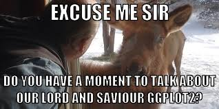
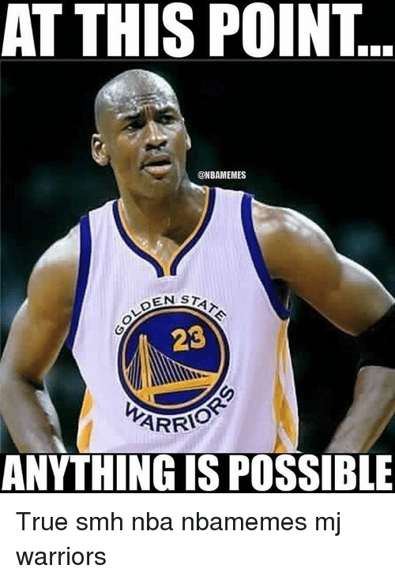

Background
------------
Did you know? ggplot is a Python implementation of the grammar of graphics.ggplot is a plotting system for Python based on R's ggplot2 and the Grammar of Graphics. Like what we have learned, one of the greatest advantages of ggplot is the ability to build professional looking and  built for making profressional looking, aesthetic plots quickly with minimal code.



Motivation
-----------
The National Basketball Association (NBA) is one of the four major professional sports league in the U.S. and Canada. NBA players are the world's best paid athletes in terms of average salary per year of a player. The NBA is composed of 30 teams and during each season, each team plays 82 games - 41 each home and away. As someone who has grown up in an all-girls boarding school, I never had as much exposure to TVs, entertainment, and sports news as the majority of high school students. Let alone to say, majority of students at my high school were prone to the arts, given that it was an all-girls environment in which I grew up in. My interest in basketball was only cultivated when my cousins would live stream their tournament games from back home through Wechat. Hence, after coming to Berkeley, my perspectives on sports and entertainment were hugely influenced by my interest in data science and statistical computation. Watching our professor analyze trends from a set of data points which I was not familiar with sparked my intellectual curiosity to explore further into this discipline. Therefore, I have decided to continue using the same data set as the one we used in class. I wanted to enjoy the journey of doing computational coding and visualization while playing around with a data set I have not been familiar with due to my upbringing.  


Introduction
-------------

This post will be  applying R functions in  ggplot, to extract trends from the large data set of NBA Players from 2017. I aim to introduce the basic skills and functions of ggplot in R to students. Given the vast application opportunities of data visualization, I strongly believe that this post will be applicable to the learnings and research works of students across all majors and backgrounds, especially those who who are at the introductory level interested in learning more about visualization through ggplot. 

Throughout the post, I may be making comments throughout the way about the significance of the visualization. At the end, instead of drawing conclusions from the trends on a macro scale, I will be stating what I found valuable throughout the learning process. 

A Few Things To Keep In Mind:
-------------

**Main Goal**

The main goal of this post is to extrapolate data, visualize graphs and draw assumptions and trends using ggplot on the topic surrounding relationships of NBA Players in 2017. This post will focus on reproducibility rather than the significance of certain trends and analyzation, as I did not intend for this to be a research paper in which coding is applied.

**Data Used**

- As aforementioned in the Motivation section, I seek to continue working with the same data set presented in lecture to get a deeper understanding of this topic of my interest. All the data tables were downloaded from our class Github page. The dataset includes a comprehensive set of player information from NBA as record from 2017. 

[NBA 2017 Players](https://github.com/ucb-stat133/stat133-fall-2017/blob/master/data/nba2017-players.csv)  

Examples of Analysis
--------
__1. Downloading Data and ggplot Functions__

To learn about ggplot, let's take the data set of NBA Player 2017 as an example, which information such as the players' teams, weights, etc. The the next step is to download the data. You can use the  codes below to download the NBA Player data and define it as "dat". After that, you can use the green button to run these codes. 

Note: when you type the function, do not include the # sign 
```{r}
# Downloading Data here
github <- "https://github.com/ucb-stat133/stat133-fall-2017/raw/master/"
csv <- "data/nba2017-players.csv"
download.file(url = paste0(github, csv), destfile = 'nba2017-players.csv')
dat <- read.csv('nba2017-players.csv', stringsAsFactors = FALSE)
```

After downloading the data, you also need to download the ggplot functions. The function "install.packages()" allows you to install functions like ggplot2, and the function "library()" enables you to load your package.

Type in "install.packages(c("dplyr", "ggplot2"))" in the chunk of the code
Loading ggplot functions: 

```{r}
library(dplyr)
library(ggplot2)
```

__2. Make Scatterplot with ggplot__

Finishing the steps above, you are ready to make the plots with functions. You can check different ggplot functions out in the cheatsheet from references. The fundamental function of ggplot is "ggplot()", by which you can build a scatterplot. For instance, you can construct a scatterplot to demonstrate the correlation between NBA players' minutes and number of games as below:

Basic ggplot function
ggplot(data = 'data', aes(x = 'indepedent variable', y = 'dependent variable')) + other ggplot functions, such as 'geom_point()', 'ggtitle()'
```{r}

# Scatter Plot of minutes & games
ggplot(data = dat, aes(x = minutes, y = games)) +
  geom_point() + 
  ggtitle("Scatter Plot of minutes & games")

# or you can also code like this:
ggplot(data = dat) +
  geom_point(aes(x = minutes, y = games)) +
  ggtitle("Scatter Plot of minutes & games 2")
```

Intuitively, the number of games and the total minutes played are in a positive correlation; the more games one athlete plays, the longer the player is on field. 

__3. Making Histograms with ggplot__

Similarly, you can create a histogram with ggplot function "geom_histogram()", to display the frequency of ages. You can modify the color, width and transparency of the histogram as well:

ggplot function for histogram:
ggplot(data = 'data', aes(x = 'variable')) + geom_histogram() + ggtitle("title")

```{r}
# Histogram for ages
ggplot(dat, aes(x = points)) +
  geom_histogram() +
  ggtitle("Histogram for ages")


```
You can adjust factors of histogram, such as width, transparency, etc:

```{r}
ggplot(dat, aes(x = points)) +
  geom_histogram(binwidth = 10, color = 'gold', alpha = 0.7) +
  ggtitle("Modified Histogram for ages")
```

Now, the frequencies are more evident through this type of expression. As we can tell, the key to visualizing trends effectively is to be cognizant of the different options and modifications available in ggplot. Certain customizations will make extrapolation much easier than others. It is amazing how coding can be such an artistic expression sometimes. 

__3. Group Plotting with ggplot__

Moreover, by using "facet_warp()" function, you can group the scatterplots of minutes and games, such as grouping it by players' positions. The shape of faceting can be changed by function "facet_grid()". You can change the direction of faceting as well:

Faceted ggplot function: 
ggplot(data = 'data', aes(x = 'variable')) + geom_point() + faceting functions(variable ~ .) or faceting functions( ~ variable) or , such as facet_wrap(~ team)

```{r}
# Scatterplot of minutes & games grouped by positions
ggplot(data = dat, aes(x = minutes, y = games)) +
  geom_point(aes(color = c(minutes)), alpha = 0.75) +
  facet_wrap(~ position) +
  ggtitle("Scatterplot of minutes & games grouped by positions")

# Horizonal Scatterplot of minutes & games grouped by positions
ggplot(data = dat, aes(x = minutes, y = games)) +
  geom_point(aes(color = position), alpha = 0.75) +
  facet_grid(position ~ .) +
  ggtitle("Scatterplot of minutes & games grouped by positions")
```

To make the previous scatterplot vertical, you can put the variable in faceting function to another side:

```{r}
ggplot(data = dat, aes(x = minutes, y = games)) +
  geom_point(aes(color = minutes), alpha = 0.75) +
  facet_grid(~ position) +
  ggtitle("Vertical Scatterplot of minutes & games grouped by positions")
```

As you can see, not only does modifying the axis and data points in ggplot influence the effectiveness of data visualization, but also the aesthetism by which we communicate information. This is especially applicable if you are doing website design - you would need to consistently question if the data charts are in alignment with the overall layout in desired positions. It is pertinent to effectively use the spacings in any design environment, and learning ggplot will help you gain a deeper understanding of this application.  

__4. Improving Your Plots__

To better the visualization, you can add loess line (locally weighted scatterplot smoothing) with function "geom_smooth(method = loess)", and  2-dimensional density with function "geom_density2d()" to the plot, as below:

```{r}
# Horizontal Scatterplot with loess line
ggplot(data = dat, aes(x = minutes, y = games)) +
  geom_point(aes(color = position), alpha = 0.75) +
  facet_grid(position ~ .) +
  geom_smooth(method = loess, color="dark grey") +
  ggtitle("Horizontal Scatterplot with loess line")

# 2-dimensional & Vertical Scatterplot
ggplot(data = dat, aes(x = minutes, y = games)) +
  geom_density2d(color = "blue") +
  geom_point(aes(color = minutes), alpha = 0.75) +
  facet_grid(~ position) +
  ggtitle("2-dimensional & Vertical Scatterplot")

```

In addition to the functions taught in class, this post will go over types of useful functions beyond lectures and discussions. Now when you look at the graphs, it is so much easier to see the trends under first impression. 

__5. Modify Plot Coordinates__

For example, in addition to  adjusting faceting, you can adjust the coordinate system of diagrams. For the previous example of histogram of ages, You can flip the coordinates with function "coord_flip()", or apply other coordinate systems to your diagram as bellow, such as using polar coordinate with function "coord_polar()":
```{r}
# Histogram for ages in flipped Coordinates
ggplot(dat, aes(x = points)) +
  geom_histogram(binwidth = 10, color = 'gold', alpha = 0.7) +
  ggtitle("Histogram for ages in flipped Coordinates") + 
  coord_flip()

# Histogram for ages in Polar Coordinate
ggplot(dat, aes(x = points)) +
  geom_histogram(binwidth = 10, color = 'gold', alpha = 0.7) +
  ggtitle("Histogram for ages in Polar Coordinates") + 
  coord_polar(theta = "x", direction = 1)
```

__6. Making Dotplot & Other Plots__

ggplot comes in handy when presenting the correlation between one continuous variable and one discrete variable. Following the cheatsheet from references, you can create and adjust a violin plot/dotplot of players' positions and ages as below:
```{r}

# Dotplot of position & age
ggplot(data = dat, aes(x = position, y = age)) +
  geom_dotplot(binaxis="y",stackdir="center", binwidth=0.5, fill="green", color="dark green") +
  ggtitle("Dotplot of position & age")

```

Likewise, you can make the plot of two discrete variables, such as the counting plot of position and age:
```{r}
# counting plot of position & age
ggplot(data = dat, aes(x = position, y = age)) +
  geom_count(aes(color=age)) +
  ggtitle("counting plot of position & age")

```

__7.Coloring the Plot__

In addition to coloring with respect to another variable, you can color the graph with different methods. For example, when making dotplot of a single continuous variable, you can add gradient colors to it by using scale functions like "scale_fill_gradient()" and "scale_fill_gradientn()" as bellow: 

Using function "scale_fill_gradient()", you can input the low and high colors.

```{r}
# gradient red & yellow color dotplot of experience
ggplot(dat, aes(x = experience)) +
  geom_dotplot(binwidth=0.45, color="white", aes(fill=..x..)) +
  scale_fill_gradient(low="red",high="yellow") +
  ggtitle("red & yellow dotplot of experience")

```

When using function "scale_fill_gradientn()", you can input the set of colors, such as "rainbow()" and "topo.colors()".

__8. Visualizing Error in Plot__

Furthermore, you can even visualize the error of data with ggplot. Assume that you're plotting the correlation between NBA players' points and positions. You can estimate the error in players' points by points3, which assumes that for each player, the maximum and minimum of points is off by player's points3. Then you can use crossbar/errorbar/pointrange to plot it. So first, you need to create another data set with function "data.frame()", with respect to players' positions, points, and points3:
```{r}
# create another data frame as data 
dat2 <- data.frame(
  position_2 = dat$position,
  points_2 = dat$points,
  points3_2 = dat$points3
)
```

Then you can use ggplot functions to present your data as below:

```{r}
# crossbar plot of position and points
ggplot(data = dat2, aes(position_2 , points_2, ymin = points_2 - points3_2, ymax = points_2 + points3_2)) +
  geom_crossbar(fatten = 2, color="gold") + ggtitle("crossbar plot of position and points")

# errorbar plot of position and points
ggplot(data = dat2, aes(position_2 , points_2, ymin = points_2 - points3_2, ymax = points_2 + points3_2)) +
  geom_errorbar(color="gold") + ggtitle("errorbar plot of position and points")

```

Conclusion
-----------
Besides those mentioned above, there're other methods to make and improve the ggplot in data analysis. Therefore, there's more for you to explore, and you can start by trying answering the questions such as: How to use scale function to change the dot shape in dotplot? How to create a three-variable plot with function "geom_contour()"? Are the colors really necessary, or are they just confusing? What can be deleted? Can variables in the plot be clarified by labeling the axes?

It is amazing how our world of data science and statistical computation and visualization can be applied to a diverse range of disciplines. I never imagined that I would be able to have the opportunity to analyze a data set of basketball players, something I never had the chance to look into back in high school. I learned about the significance of ggplot in visualization; any modification in such functions may cause a change in the plots which would lead to a greater change to how the audience may extrapolate or analyze data. This will be with me as I move forward with design and other computation works, where a slight modification of detail will inflict certain bias in reading the graphs, causing major discrepencies in data analyses. 

Blogger's Takeaway Message
-----------------
It is always easy to notice patterns in societies, but never easy to have the persistency to go above and beyond to conquer that curiosity. What is amazing about the project is the experience of having been able to not only explore an area of interest, but moreover apply the skillsets in R to add significance to the data bulks there are online. A major role a data scientist plays is the ability to identify the problem, to sort out the data in ways that specifically target that problem, and to ultimately assess the applicable skills on hands and resolve the problem. The two most powerful skillsets are being able to filter out unnecessary data, and being able to zoom in and target different but converging perspectives.

References
-----------------
* "Python Software Foundation":
https://pypi.python.org/pypi/ggplot
* "ggplot from ŷhat"
http://ggplot.yhathq.com/
* https://en.wikipedia.org/wiki/National_Basketball_Association
* "R for Biologists: Several plot types in just a few minutes" by Maria Nattestad:
https://www.youtube.com/watch?v=pibGllDeBPM
* "Introduction to Data Visualization with R and ggplot2" by Data Science Dojo: 
https://www.youtube.com/watch?v=49fADBfcDD4
* "Plotting in R tutorial: Gorgeous graphs with ggplot2" by deltaDNA: 
https://www.youtube.com/watch?v=rsG-GgR0aEY
* ggplot cheatsheat:
https://www.rstudio.com/wp-content/uploads/2015/03/ggplot2-cheatsheet.pdf
* "ggplot with three y-variables R":
https://stackoverflow.com/questions/41172451/ggplot-with-three-y-variables-r
* "Summarizing 3 categorical variables using R (and ggplot)":
https://www.youtube.com/watch?v=TJKskHT_zQs
* "ggplot2 tutorial: Multiple Groups and Variables":
https://www.youtube.com/watch?v=-jO2wuu7GUQ

Final Words
------------
Thank you for reading until the end. I hope you enjoyed learning about the relationship trends in NBA Players 2017 as much as I enjoyed researching, visualizing, and analyzing this topic! 



___


